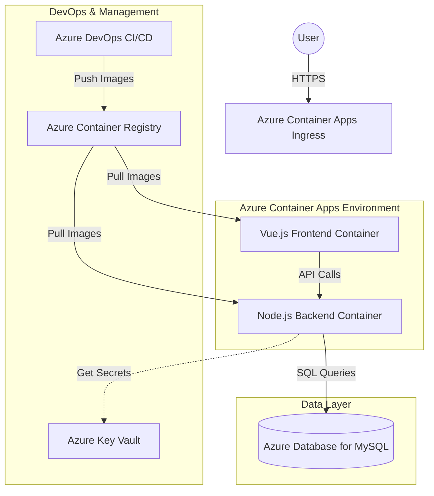

# work-edm

## About the App

**work-edm** is a comprehensive Employee Data Management application designed to streamline the handling of employee information within an organization. This web-based application provides a user-friendly interface for managing employee records, including features such as adding new employees, updating details, viewing profiles, and generating reports. It caters to HR departments, managers, and administrators who need efficient tools for workforce management.

### Key Features
- **Employee CRUD Operations**: Create, read, update, and delete employee records.
- **User Authentication**: Secure login and role-based access control.
- **Data Visualization**: Dashboards and reports for insights into employee data.
- **Scalable Architecture**: Built to handle growing organizational needs.

### Architecture Overview
The application follows a three-tier architecture hosted on Azure Container Apps (ACA), ensuring a serverless, scalable, and maintainable environment:
- **Frontend**: Vue.js-based single-page application (SPA) containerized for deployment.
- **Backend**: Node.js with Express framework, handling API requests and business logic.
- **Database**: Azure Database for MySQL (Flexible Server) for reliable data persistence.

This setup leverages Azure's managed services for high availability, automatic scaling, and reduced operational overhead. Infrastructure is provisioned using Terraform, and deployments are automated via Azure DevOps CI/CD pipelines.

### Project Structure
- `app/`: Backend Node.js application code.
- `db/`: Database schemas, migrations, and related scripts.
- `web/`: Frontend Vue.js application code.
- `iac/`: Infrastructure as Code (IaC) configurations, including Terraform modules and Azure DevOps pipeline definitions.

### Getting Started
To contribute or work on this project, ensure you have Node.js, Vue CLI, Terraform, and Azure CLI installed. Clone the repository, set up your Azure environment, and follow the deployment instructions in the sections below.

## work-edm | Project Plan

1. Architecture Diagram
The following diagram illustrates the flow of traffic from the user through the Azure infrastructure to your containerized services.

2. Tech Stack Requirements

* Frontend: Vue.js (Containerized).
* Backend: Node.js with Express (Containerized).
* Database: Azure Database for MySQL (Flexible Server).
* Hosting: Azure Container Apps (ACA).
* Container Registry: Azure Container Registry (ACR).
* IaC: Terraform for infrastructure provisioning.
* CI/CD: Azure DevOps Pipelines.

3. Infrastructure Management (Terraform)
You will use the azurerm provider to define your resources in a modular way. Key resources include:

* azurerm_container_app_environment: The shared environment for your frontend and backend containers.
* azurerm_container_app: Individual definitions for the frontend and app services.
* azurerm_mysql_flexible_server: Managed MySQL instance with a firewall rule allowing access from Azure services.
* azurerm_container_registry: To host your private Docker images.

4. Deployment Strategy (Azure DevOps CI/CD)
The deployment is handled via a multi-stage YAML pipeline (azure-pipelines.yml):

   1. Build Stage:
   * Triggered by commits to the main branch.
      * Builds Docker images for both Vue and Node services.
      * Pushes images to Azure Container Registry.
   2. Infrastructure Stage:
   * Runs terraform apply to ensure the Azure environment is up-to-date.
   3. Deploy Stage:
   * Updates the Azure Container Apps with the new image tags using the AzureContainerApps@1 task.
      * Configures environment variables (e.g., DB_HOST, DB_USER) within the ACA revisions.
   
5. Essential Security & Best Practices

* Managed Identity: Enable system-assigned managed identities on your containers to securely pull images from ACR without storing passwords.
* Secrets: Store database credentials in Azure Key Vault and reference them as secrets in your Container App.
* Autoscaling: Configure scale rules based on HTTP traffic or CPU usage to handle spikes in employee data management tasks.
